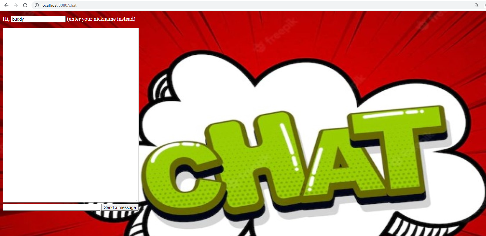
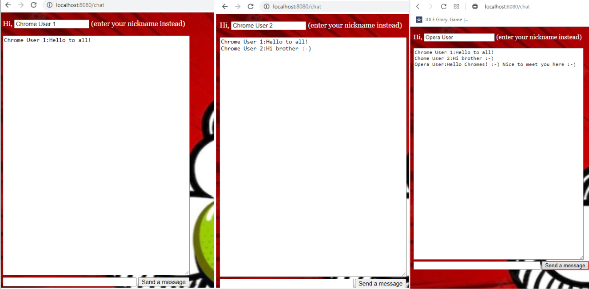

# websocket_chat
Одно из заданий, выполненных в процессе прохождения курса "Разработка веб сервиса на Java (часть 1)" на платформе Stepic.

Старт приложения производится путем запуска метода main() в классе Main. Предварительно следует пометить папку src как Sources Root. Приложение разворачивается в контекстном пути http://localhost:8080/.
 

 Функционал: при входе в верхнем маленьком окошке вводится имя пользователя (nickname), после чего в большом окне можно писать сообщения, которые будут отображаться во всех открытых окнах чата во всех браузерах.

Использованные технологии: Java SE, Java EE, Jetty, a little of HTML & JavaScript.

