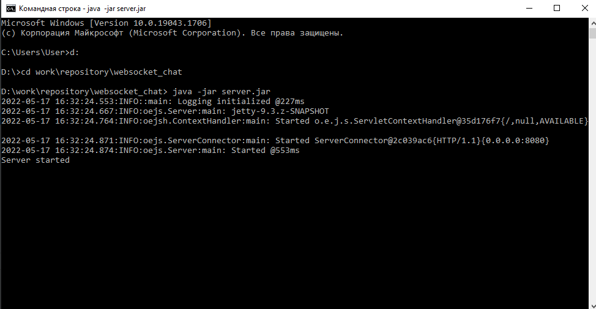

# websocket_chat

Одно из заданий, выполненных в процессе прохождения курса 
<a href="https://stepik.org/course/146" target="_blank">
"Разработка веб сервиса на Java (часть 1)"</a> на платформе Stepik.org

Старт приложения производится путем запуска метода main() в классе Main. 
Предварительно следует пометить папку src как Sources Root. 
Приложение разворачивается в контекстном пути http://localhost:8080/chat.

Также можно осуществить запуск через командную строку: java -jar server.jar

 Функционал: при входе в верхнем маленьком окошке вводится имя пользователя (nickname), 
после чего в большом окне можно писать сообщения, которые будут отображаться во всех открытых окнах 
чата во всех браузерах.

Использованные технологии: Java EE, Maven, Jetty, a little of HTML & JS.

  

  
