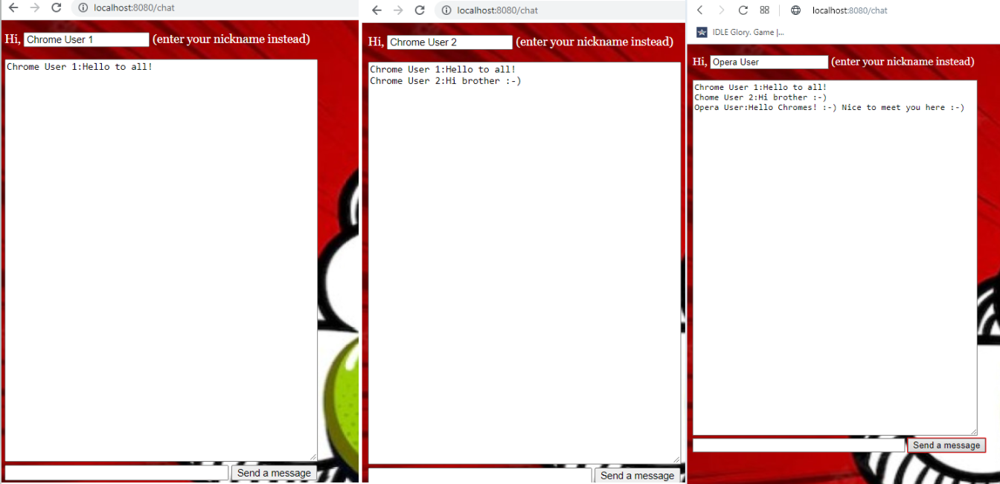

# websocket_chat

Одно из заданий, выполненных в процессе прохождения курса 
["Разработка веб сервиса на Java (часть 1)"](https://stepik.org/course/146) на платформе Stepik.org.

Старт приложения производится путем запуска метода main() в классе Main.  
Предварительно следует пометить папку src как Sources Root. 

Приложение разворачивается в контекстном пути http://localhost:8080/chat.  
Также можно осуществить запуск через командную строку: java -jar server.jar.

Функционал: при входе в верхнем маленьком окошке вводится имя пользователя (nickname), 
после чего в большом окне можно писать сообщения, которые будут отображаться во всех открытых окнах 
чата во всех браузерах :boy::girl::woman::man::older_woman::older_man::man_with_turban:.

Использованные технологии: Java EE, Maven, Jetty, a little of HTML & JS.

